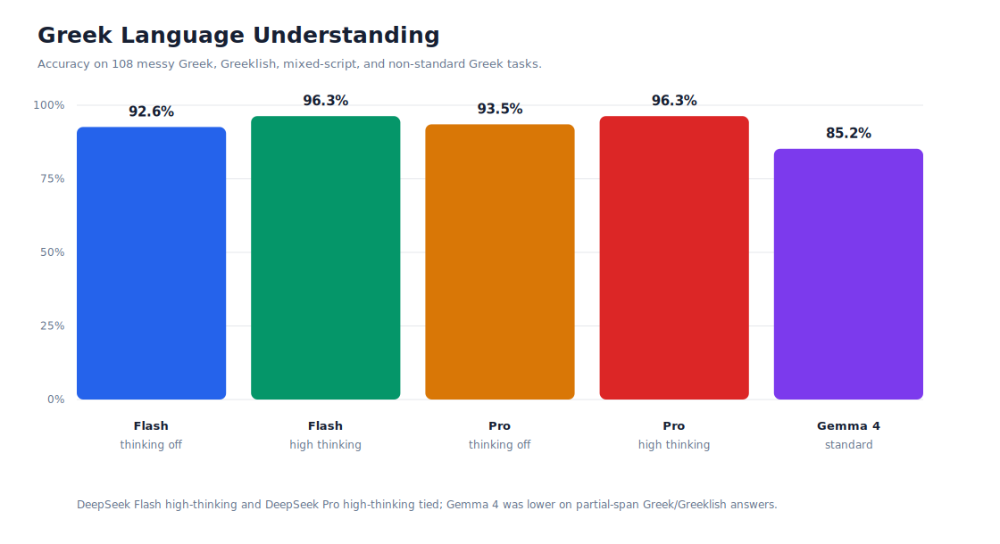
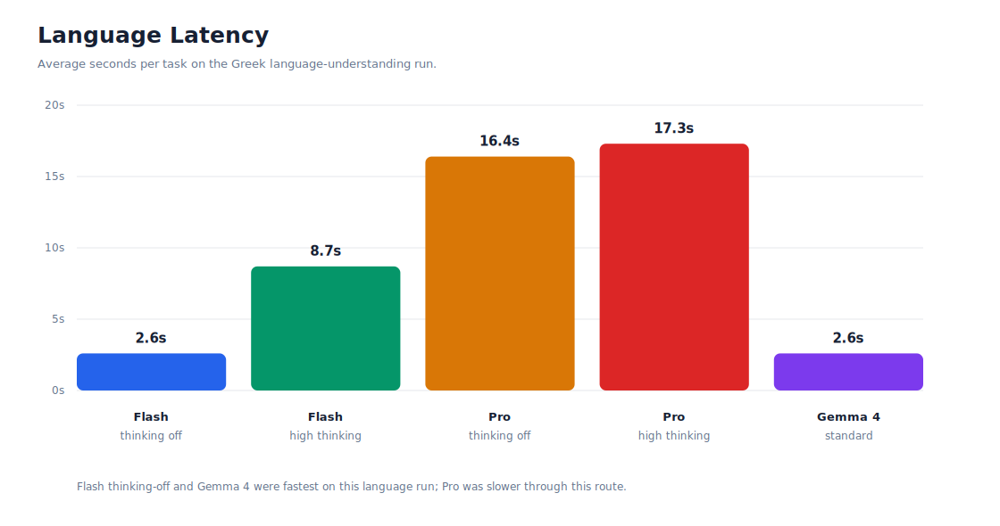
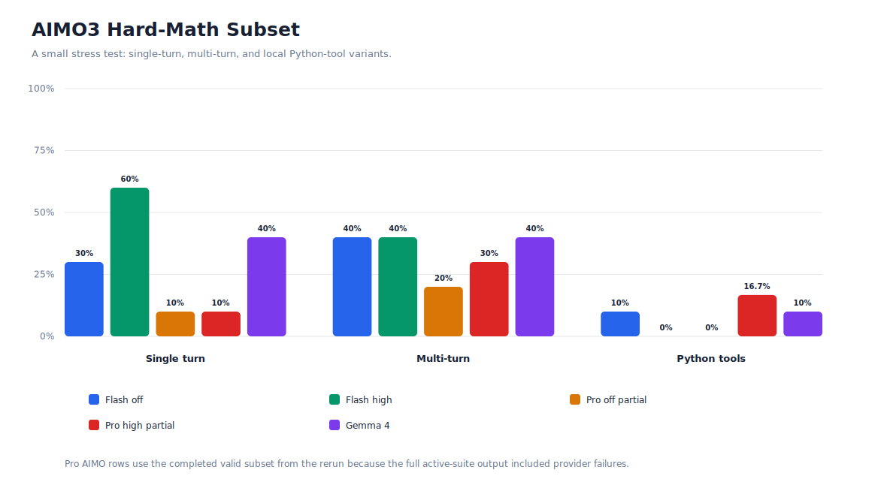

# Agent Eval Lab

Async evaluation harness for comparing language-model behavior on Greek language understanding, simple reasoning, multi-turn state tracking, Python tool use, and a small AIMO3 hard-math set.

This repository currently publishes one focused comparison:

- DeepSeek V4 Flash
- DeepSeek V4 Pro
- Gemma 4 31B IT

The goal is not to claim a universal benchmark. The goal is to make a small, repeatable, inspectable evaluation suite for the kinds of tasks we care about: messy Greek/Greeklish language understanding, basic logic, basic math, and whether Python tools actually help on hard math.

## What This Tests

The active suite contains:

| Benchmark | Tasks | What it checks |
|---|---:|---|
| `language_understanding` | 108 | Greek, Greeklish, mixed Greek/Latin, and imperfect/non-standard Greek text. |
| `sample_math` | 8 | Basic arithmetic. |
| `sample_logic` | 6 | Small deductive and ordering problems. |
| `sample_multiturn` | 2 | Simple state tracking across turns. |
| `sample_tools` | 2 | Basic Python tool calling. |
| `aimo3_reference` | 10 | Hard AIMO3-style math, single turn. |
| `aimo3_reference_multiturn` | 10 | Same hard math with multi-round prompting. |
| `aimo3_reference_python_tools` | 10 | Same hard math with local Python tool access. |

The language benchmark is Greek-focused, but it is not a clean grammar exam. It intentionally includes messy real-world text: missing accents, typos, Greeklish, mixed scripts, chat-like wording, names, dates, numbers, and short fragment answers.

## Results Summary

### Greek Language Understanding

All models below were evaluated on the same 108-task `language_understanding` set.



| Model | Run mode | Correct | Accuracy | Avg latency | Tokens |
|---|---|---:|---:|---:|---:|
| DeepSeek V4 Flash | thinking disabled | 100 / 108 | 92.6% | 2.6s | 48,529 |
| DeepSeek V4 Flash | high thinking | 104 / 108 | 96.3% | 8.7s | 142,312 |
| DeepSeek V4 Pro | thinking disabled | 101 / 108 | 93.5% | 16.4s | 82,914 |
| DeepSeek V4 Pro | high thinking | 104 / 108 | 96.3% | 17.3s | 86,224 |
| Gemma 4 31B IT Nitro | standard | 92 / 108 | 85.2% | 2.6s | 46,944 |



Takeaway: DeepSeek Flash high-thinking and DeepSeek Pro high-thinking tied on this Greek language set. Flash got there with much lower latency in this run. Gemma was fast and handled many simple cases, but missed more partial-span answers in messy Greek/Greeklish text.

### Active Suite

DeepSeek Flash and Gemma were run across the full active suite. DeepSeek Pro has valid language results and a completed hard-math subset; the full Pro active-suite run was interrupted by provider-side limits, so Pro is not shown as a full-suite number.

| Benchmark | DeepSeek Flash, thinking disabled | DeepSeek Flash, high thinking | Gemma 4 31B IT Nitro |
|---|---:|---:|---:|
| `language_understanding` | 100 / 108, 92.6% | 104 / 108, 96.3% | 92 / 108, 85.2% |
| `sample_math` | 8 / 8, 100.0% | 8 / 8, 100.0% | 8 / 8, 100.0% |
| `sample_logic` | 6 / 6, 100.0% | 6 / 6, 100.0% | 6 / 6, 100.0% |
| `sample_multiturn` | 2 / 2, 100.0% | 2 / 2, 100.0% | 2 / 2, 100.0% |
| `sample_tools` | 2 / 2, 100.0% | 2 / 2, 100.0% | 2 / 2, 100.0% |
| `aimo3_reference` | 3 / 10, 30.0% | 6 / 10, 60.0% | 4 / 10, 40.0% |
| `aimo3_reference_multiturn` | 4 / 10, 40.0% | 4 / 10, 40.0% | 4 / 10, 40.0% |
| `aimo3_reference_python_tools` | 1 / 10, 10.0% | 0 / 10, 0.0% | 1 / 10, 10.0% |

Full active-suite summary:

| Model | Correct | Accuracy | Tokens | Reasoning tokens | Avg latency |
|---|---:|---:|---:|---:|---:|
| DeepSeek V4 Flash, thinking disabled | 126 / 156 | 80.8% | 661,035 | 0 | 20.8s |
| DeepSeek V4 Flash, high thinking | 132 / 156 | 84.6% | 1,262,225 | 823,681 | 109.5s |
| Gemma 4 31B IT Nitro | 119 / 156 | 76.3% | 164,388 | 0 | 98.4s |

### AIMO3 Hard Math



The AIMO3 subset is deliberately hard and small. It should be read as a stress test, not as a broad math benchmark.

| Model | Single turn | Multi-turn | Python tools |
|---|---:|---:|---:|
| DeepSeek V4 Flash, thinking disabled | 3 / 10 | 4 / 10 | 1 / 10 |
| DeepSeek V4 Flash, high thinking | 6 / 10 | 4 / 10 | 0 / 10 |
| DeepSeek V4 Pro, thinking disabled | 1 / 10 | 2 / 10 | 0 / 7 |
| DeepSeek V4 Pro, high thinking | 1 / 10 | 3 / 10 | 1 / 6 |
| Gemma 4 31B IT Nitro | 4 / 10 | 4 / 10 | 1 / 10 |

Takeaway: high-thinking Flash did best on the single-turn AIMO3 subset, but none of the tested models are reliable enough for hard AIMO3-style math here. Multi-turn prompting and Python tool access did not consistently rescue performance.

## Main Conclusion

DeepSeek V4 Flash is the strongest practical fit in these runs: it is excellent on the Greek language benchmark, clears the simple reasoning/tool smoke tests, and performs best among the full-suite runs.

DeepSeek V4 Pro is strong on Greek language understanding, but in this setup it did not clearly beat Flash on the language set and its hard-math run was only partially completed.

Gemma 4 31B IT Nitro is a useful smaller baseline. It clears the simple math, logic, multi-turn, and basic tool tasks, but trails DeepSeek on messy Greek/Greeklish language understanding and is also weak on the hard AIMO3 subset.

## Install

```bash
uv sync --extra dev
```

Put provider keys in `.env`:

```bash
OPENROUTER_API_KEY=...
OPENCODE_API_KEY=...
```

Model config references environment variable names only. Secrets should not be committed.

## Run

List available config:

```bash
uv run agent-eval list-config
```

Run the full active suite for the configured models:

```bash
uv run agent-eval run \
  --model deepseek-v4-flash-none \
  --model deepseek-v4-flash-high \
  --model openrouter-gemma-4-31b-it-nitro \
  --context-size 65536
```

Run only the Greek language-understanding benchmark:

```bash
uv run agent-eval run \
  --benchmark language_understanding \
  --model deepseek-v4-flash-none \
  --model deepseek-v4-flash-high \
  --model openrouter-deepseek-v4-pro-none \
  --model openrouter-deepseek-v4-pro-high \
  --model openrouter-gemma-4-31b-it-nitro \
  --context-size 65536
```

Generate a Markdown report from a JSONL result file:

```bash
uv run agent-eval report --results results/your_run.jsonl
```

Mock mode works without API keys:

```bash
uv run agent-eval run --mock
```

## Project Structure

```text
configs/
  benchmarks.yaml      # benchmark registry
  models.yaml          # DeepSeek/Gemma model definitions
  prompts.yaml         # prompt templates
  runner.yaml          # concurrency, retries, timeouts
  tools.yaml           # enabled local tools
data/
  *.jsonl              # benchmark task files
docs/images/
  *.svg                # published comparison charts
src/agent_eval/
  cli.py               # Typer CLI
  runner.py            # async evaluation runner
  flows/               # single-turn, multi-turn, tool-calling flows
  llm.py               # LiteLLM client and usage parsing
  scoring.py           # exact/normalized/regex scoring
  reporting.py         # Markdown reports
tests/
  test_*.py            # unit tests
```

## Artifacts

Curated result files:

```text
results/deepseek_v4_flash_thinking_none_high_all_active_20260516.jsonl
reports/deepseek_v4_flash_thinking_none_high_all_active_20260516.md

results/openrouter_deepseek_v4_pro_none_high_language_20c_20260517.jsonl
reports/openrouter_deepseek_v4_pro_none_high_language_20c_20260517.md

results/deepseek_v4_pro_none_high_completed_subset_20260517.jsonl
reports/deepseek_v4_pro_none_high_completed_subset_20260517.md

results/openrouter_gemma_4_31b_it_nitro_all_active_combined_20260517.jsonl
reports/openrouter_gemma_4_31b_it_nitro_all_active_combined_20260517.md
```

Published charts:

```text
docs/images/model-language-accuracy.svg
docs/images/model-language-latency.svg
docs/images/model-aimo-accuracy.svg
```

## Testing

```bash
UV_CACHE_DIR=.uv-cache uv run pytest -q
UV_CACHE_DIR=.uv-cache uv run vulture src tests --min-confidence 80
```

Current local status:

- `46 passed`
- `100%` test coverage
- `vulture` clean

## License

Agent Eval Lab is released under the MIT License. See [LICENSE](LICENSE).

## Dependency Credits

Runtime dependencies:

| Dependency | License |
|---|---|
| LiteLLM | MIT |
| PocketFlow | MIT |
| Pydantic | MIT |
| python-dotenv | BSD-3-Clause |
| PyYAML | MIT |
| Rich | MIT |
| Typer | MIT |

Development dependencies:

| Dependency | License |
|---|---|
| pytest | MIT |
| pytest-asyncio | Apache-2.0 |
| pytest-cov | MIT |
| Vulture | MIT |

Transitive dependencies are pinned in `uv.lock`; the installed dependency scan found permissive or weak-file-level licenses only, with no GPL/LGPL/AGPL packages.

## Limitations

- The language benchmark is Greek-focused and intentionally includes messy/non-standard text.
- Scoring is exact, normalized, or regex-based. It does not use judge-model grading.
- The AIMO3 set is small and intentionally difficult.
- DeepSeek Pro hard-math results are partial because the full run was interrupted by provider-side limits.
- Local Python execution is for controlled evaluation tasks, not a hardened sandbox for untrusted code.
