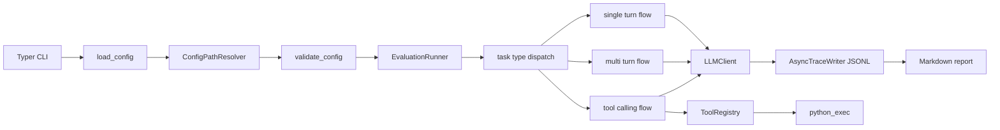

# llm-eval-tool

Async evaluation harness for comparing language-model behavior on Greek language understanding, simple reasoning, multi-turn state tracking, Python tool use, and a small AIMO3 hard-math set.

This repository currently publishes one focused comparison:

- DeepSeek V4 Flash
- DeepSeek V4 Pro
- Gemma 4 31B IT

The goal is not to claim a universal benchmark. The goal is to make a small, repeatable, inspectable evaluation suite for the kinds of tasks we care about: messy Greek/Greeklish language understanding, basic logic, basic math, and whether Python tools actually help on hard math.

## What This Tests

The active suite contains:

| Benchmark | Tasks | What it checks |
|---|---:|---|
| `language_understanding` | 108 | Greek, Greeklish, mixed Greek/Latin, and imperfect/non-standard Greek text. |
| `sample_math` | 8 | Basic arithmetic. |
| `sample_logic` | 6 | Small deductive and ordering problems. |
| `sample_multiturn` | 2 | Simple state tracking across turns. |
| `sample_tools` | 2 | Basic Python tool calling. |
| `aimo3_reference` | 10 | Hard AIMO3-style math, single turn. |
| `aimo3_reference_multiturn` | 10 | Same hard math with multi-round prompting. |
| `aimo3_reference_python_tools` | 10 | Same hard math with local Python tool access. |

The language benchmark is Greek-focused, but it is not a clean grammar exam. It intentionally includes messy real-world text: missing accents, typos, Greeklish, mixed scripts, chat-like wording, names, dates, numbers, and short fragment answers.

Language scoring first checks the extracted answer, then checks task regexes and normalized containment against the raw response. It also applies deterministic semantic matching for Greek/Greeklish and mixed-script answers by folding accents/punctuation, transliterating Greek to Greeklish, and comparing content-token coverage. It does not use a judge model.

## Results Summary

### Greek Language Understanding

All models below were evaluated on the same 108-task `language_understanding` set.


| Model | Run mode | Correct | Accuracy | Avg latency | Tokens |
|---|---|---:|---:|---:|---:|
| DeepSeek V4 Flash | thinking disabled | 107 / 108 | 99.1% | 2.6s | 48,529 |
| DeepSeek V4 Flash | high thinking | 108 / 108 | 100.0% | 8.7s | 142,312 |
| DeepSeek V4 Pro | thinking disabled | 105 / 108 | 97.2% | 16.4s | 82,914 |
| DeepSeek V4 Pro | high thinking | 106 / 108 | 98.1% | 17.3s | 86,224 |
| Gemma 4 31B IT Nitro | standard | 102 / 108 | 94.4% | 2.6s | 46,944 |


Takeaway: semantic rescoring raises the language numbers because many correct answers were phrased as Greek/Greeklish paraphrases instead of exact spans. DeepSeek Flash high-thinking reached 108/108, Flash thinking-disabled missed one task, and Pro remained close but slower through this route. Gemma was fast and stronger than the original exact-span score suggested, but still trailed the DeepSeek runs.

### Active Suite

DeepSeek Flash and Gemma were run across the full active suite. DeepSeek Pro was rerun, but the full active-suite run included many provider-side failure rows. The published Pro hard-math numbers therefore use the completed valid subset, while Pro language uses the clean OpenRouter language run.

| Benchmark | DeepSeek Flash, thinking disabled | DeepSeek Flash, high thinking | Gemma 4 31B IT Nitro |
|---|---:|---:|---:|
| `language_understanding` | 107 / 108, 99.1% | 108 / 108, 100.0% | 102 / 108, 94.4% |
| `sample_math` | 8 / 8, 100.0% | 8 / 8, 100.0% | 8 / 8, 100.0% |
| `sample_logic` | 6 / 6, 100.0% | 6 / 6, 100.0% | 6 / 6, 100.0% |
| `sample_multiturn` | 2 / 2, 100.0% | 2 / 2, 100.0% | 2 / 2, 100.0% |
| `sample_tools` | 2 / 2, 100.0% | 2 / 2, 100.0% | 2 / 2, 100.0% |
| `aimo3_reference` | 3 / 10, 30.0% | 6 / 10, 60.0% | 4 / 10, 40.0% |
| `aimo3_reference_multiturn` | 5 / 10, 50.0% | 4 / 10, 40.0% | 5 / 10, 50.0% |
| `aimo3_reference_python_tools` | 3 / 10, 30.0% | 0 / 10, 0.0% | 1 / 10, 10.0% |

Full active-suite summary:

| Model | Correct | Accuracy | Tokens | Reasoning tokens | Avg latency |
|---|---:|---:|---:|---:|---:|
| DeepSeek V4 Flash, thinking disabled | 136 / 156 | 87.2% | 661,035 | 0 | 20.8s |
| DeepSeek V4 Flash, high thinking | 136 / 156 | 87.2% | 1,262,225 | 823,681 | 109.5s |
| Gemma 4 31B IT Nitro | 130 / 156 | 83.3% | 164,388 | 0 | 98.4s |

### AIMO3 Hard Math


The AIMO3 subset is deliberately hard and small. It should be read as a stress test, not as a broad math benchmark.

| Model | Single turn | Multi-turn | Python tools |
|---|---:|---:|---:|
| DeepSeek V4 Flash, thinking disabled | 3 / 10 | 5 / 10 | 3 / 10 |
| DeepSeek V4 Flash, high thinking | 6 / 10 | 4 / 10 | 0 / 10 |
| DeepSeek V4 Pro, thinking disabled | 2 / 10 | 2 / 10 | 2 / 7 |
| DeepSeek V4 Pro, high thinking | 1 / 10 | 3 / 10 | 1 / 6 |
| Gemma 4 31B IT Nitro | 4 / 10 | 5 / 10 | 1 / 10 |

Takeaway: high-thinking Flash did best on the single-turn AIMO3 subset, but none of the tested models are reliable enough for hard AIMO3-style math here. Multi-turn prompting and Python tool access helped some individual rows after semantic rescoring, but did not consistently rescue performance.

## Main Conclusion

DeepSeek V4 Flash is the strongest practical fit in these runs: it is excellent on the Greek language benchmark, clears the simple reasoning/tool smoke tests, and remains best among the full-suite runs. High-thinking gets the cleanest language score, while thinking-disabled ties it on the full active suite with much lower latency.

DeepSeek V4 Pro is strong on Greek language understanding, but in this setup it did not beat Flash on the language set. Its published hard-math numbers come from the completed valid subset of the rerun, not a clean full active-suite pass.

Gemma 4 31B IT Nitro is a useful smaller baseline. It clears the simple math, logic, multi-turn, and basic tool tasks, and semantic scoring shows it handles more messy Greek/Greeklish answers than exact-span scoring credited. It still trails DeepSeek on language understanding and is weak on the hard AIMO3 subset.

## Install

```bash
uv sync --extra dev
```

Put provider keys in `.env`:

```bash
OPENROUTER_API_KEY=...
OPENCODE_API_KEY=...
```

Model config references environment variable names only. Secrets should not be committed.

## Run

List available config:

```bash
uv run llm-eval list-config
```

Run the full active suite for the configured models:

```bash
uv run llm-eval run \
  --model deepseek-v4-flash-none \
  --model deepseek-v4-flash-high \
  --model openrouter-gemma-4-31b-it-nitro \
  --context-size 65536
```

Run only the Greek language-understanding benchmark:

```bash
uv run llm-eval run \
  --benchmark language_understanding \
  --model deepseek-v4-flash-none \
  --model deepseek-v4-flash-high \
  --model openrouter-deepseek-v4-pro-none \
  --model openrouter-deepseek-v4-pro-high \
  --model openrouter-gemma-4-31b-it-nitro \
  --context-size 65536
```

Generate a Markdown report from a JSONL result file:

```bash
uv run llm-eval report --results results/your_run.jsonl
```

Mock mode works without API keys:

```bash
uv run llm-eval run --mock
```

Validate configuration and benchmark files without making model calls:

```bash
uv run llm-eval validate
```

Use `--config-root` when running from a checkout that is not the repository root, or when validating a copied config/data tree. Relative config paths are resolved from that root before benchmark JSONL files are loaded.

```bash
uv run llm-eval validate --config-root /path/to/eval-config
uv run llm-eval run --config-root /path/to/eval-config --mock
```

## Project Structure

```text
configs/
  benchmarks.yaml      # benchmark registry
  models.yaml          # DeepSeek/Gemma model definitions
  prompts.yaml         # prompt templates
  runner.yaml          # concurrency, retries, timeouts
  tools.yaml           # enabled local tools
data/
  *.jsonl              # benchmark task files
docs/images/
  *.svg                # published comparison charts
src/llm_eval/
  cli.py               # Typer CLI
  config.py            # config loading, path resolution, validation
  schemas.py           # Pydantic config, task, trace, and result schemas
  runner.py            # async evaluation runner
  flows/               # single-turn, multi-turn, tool-calling flows
  llm.py               # LiteLLM client and usage parsing
  tools.py             # tool registry and local tool implementations
  trace_writer.py      # async JSONL result writer
  scoring.py           # exact/regex/semantic answer scoring
  reporting.py         # Markdown reports
tests/
  test_*.py            # unit tests
```

## Architecture Overview

The harness is intentionally small and file-oriented. Configuration YAML points to JSONL benchmark files, each task is validated into a typed schema, and every model/task result is appended to a JSONL trace before a Markdown report is generated.



Key maintainability seams:

- The CLI applies overrides and calls config validation before running evaluations.
- `ConfigPathResolver` keeps relative config and benchmark paths portable through `--config-root`.
- `validate_config()` checks duplicate names, model/provider references, benchmark/prompt references, task JSONL validity, task type consistency, duplicate task ids, expected tool availability, and configured tool availability.
- `EvaluationRunner` owns concurrency, retries, task filtering, trace writing, and flow dispatch.
- Flow modules keep prompt/message construction separate for single-turn, multi-turn, and tool-calling tasks.
- `LLMClient` is a protocol boundary; `LiteLLMClient` implements real provider calls and mock mode.
- `ToolRegistry` owns OpenAI-compatible tool schemas and execution, while tool traces are stored with evaluation results.

## Configuration Validation

Run validation before committing config, prompt, benchmark, or tool changes:

```bash
uv run llm-eval validate
```

The command is a dry run: it loads config, resolves benchmark paths, parses every referenced task JSONL file, checks configured references and tool availability, and exits before scheduling model calls or writing results. It is the fastest way to catch schema, path, and registry mistakes.

`--config-root` is available on `run`, `validate`, and `list-config`. The default is the current directory. When provided, default config files are read from `<root>/configs/*.yaml`, and relative benchmark paths inside those config files are resolved from the same root. Absolute paths remain absolute.

Examples:

```bash
uv run llm-eval validate --config-root .
uv run llm-eval list-config --config-root .
uv run llm-eval run --config-root . --benchmark sample_math --mock
```

CLI overrides such as `--max-attempts`, `--request-timeout`, `--task-timeout`, `--global-limit`, `--per-model-limit`, `--max-tokens`, and `--context-size` are assignment-validated before the run starts. `--max-tokens` and `--context-size` set the same model budget; provide only one unless the values match.

## Task JSONL Schemas

Each benchmark file is newline-delimited JSON. Blank lines are ignored. Every nonblank line must parse as one task whose `task_type` matches the `task_type` declared for that benchmark in `configs/benchmarks.yaml`.

Common fields:

| Field | Required | Notes |
|---|---|---|
| `id` | yes | Unique within the benchmark file. |
| `task_type` | yes | One of `single_turn`, `multi_turn`, or `tool_calling`. |
| `answer` | yes | Expected final answer used by scoring. |
| `answer_regex` | no | Optional regex accepted by scoring instead of exact normalized answer. |
| `category` | no | Defaults to `default`; usable with `--include` and `--exclude`. |

Single-turn tasks provide a question string:

```json
{"id":"math_001","task_type":"single_turn","category":"arithmetic","question":"What is 17 + 25?","answer":"42"}
```

Multi-turn tasks provide prior chat messages. The runner sends these turns directly to the model flow and scores the final model response:

```json
{"id":"state_001","task_type":"multi_turn","turns":[{"role":"user","content":"Remember the code word: iris."},{"role":"assistant","content":"Noted."},{"role":"user","content":"What code word did I give you?"}],"answer":"iris"}
```

Tool-calling tasks provide a question and may list expected tools. Expected tools must be enabled in `configs/tools.yaml` and registered by `ToolRegistry`:

```json
{"id":"tool_001","task_type":"tool_calling","category":"python","question":"Use Python to compute 19 * 23. Return only the number.","answer":"437","expected_tools":["python_exec"]}
```

Validation expectations:

- Required strings must be non-empty.
- Task ids must not repeat within a benchmark file.
- `task_type` in each row must match the benchmark declaration.
- `expected_tools` may only reference enabled and registered tools.
- Invalid JSON or schema errors are reported with the benchmark path and line number.

## Artifacts

Curated result files:

```text
results/deepseek_v4_flash_thinking_none_high_all_active_20260516.jsonl
reports/deepseek_v4_flash_thinking_none_high_all_active_20260516.md

results/openrouter_deepseek_v4_pro_none_high_language_20c_20260517.jsonl
reports/openrouter_deepseek_v4_pro_none_high_language_20c_20260517.md

results/deepseek_v4_pro_none_high_all_active_4h_15c_20260516.jsonl
reports/deepseek_v4_pro_none_high_all_active_4h_15c_20260516.md

results/deepseek_v4_pro_none_high_completed_subset_20260517.jsonl
reports/deepseek_v4_pro_none_high_completed_subset_20260517.md

results/openrouter_gemma_4_31b_it_nitro_all_active_combined_20260517.jsonl
reports/openrouter_gemma_4_31b_it_nitro_all_active_combined_20260517.md

results/openrouter_gemma_4_31b_it_nitro_language_20c_20260517.jsonl
reports/openrouter_gemma_4_31b_it_nitro_language_20c_20260517.md

results/openrouter_gemma_4_31b_it_nitro_remaining_active_20c_retry_20260517.jsonl

results/openrouter_gemma_4_31b_it_nitro_tool_retries_50_20260517.jsonl
reports/openrouter_gemma_4_31b_it_nitro_tool_retries_50_20260517.md
```

Published charts:

```text
docs/images/model-language-accuracy.svg
docs/images/model-language-latency.svg
docs/images/model-aimo-accuracy.svg
```

## Developer Workflow

```bash
uv run pytest -q
uv run ruff check src tests
uv run --extra dev pre-commit run --all-files
```

Use `uv run pytest -q` for the unit suite, including branch coverage enforcement from `pyproject.toml`. Use `uv run ruff check src tests` for lint checks. Run pre-commit before opening a pull request when Markdown, YAML, TOML, Python, or benchmark files changed; it runs standard file hygiene checks plus Ruff and pytest.

CI runs on pull requests and pushes to `main` for Python 3.11 and 3.12. The workflow installs dependencies with `uv sync --extra dev`, then runs Ruff and pytest. If CI fails, reproduce the failing command locally before updating code or documentation.

Recent Phase 5 validation status:

- `70 passed`
- `97.99%` test coverage
- `uv run ruff check src tests` passed
- `uv run --extra dev pre-commit run --all-files` passed

## Security Note

The `python_exec` tool executes local Python code generated during tool-use evaluations. It runs snippets with the current Python interpreter in isolated mode (`-I`), inside a temporary working directory, with stdin disabled and a short timeout. Those controls reduce accidental damage, but they are not a full security sandbox.

Operational recommendations:

- Treat `python_exec` as trusted-local-only infrastructure. Do not expose it through a public API, shared bot, web app, or multi-tenant service.
- Run tool-calling evaluations in an environment without production secrets, cloud credentials, SSH agents, or sensitive local files.
- Prefer disposable containers, short-lived virtual machines, or locked-down local users for untrusted benchmark prompts or model providers.
- Keep `python_exec` disabled in `configs/tools.yaml` unless a benchmark explicitly needs it.
- Review tool traces in result JSONL files and reports when investigating unexpected model behavior.
- Do not assume timeout, temporary directories, or Python isolated mode prevent all filesystem, CPU, memory, or network misuse.

## License

llm-eval-tool is released under the MIT License. See [LICENSE](LICENSE).

## Dependency Credits

Runtime dependencies:

| Dependency | License |
|---|---|
| LiteLLM | MIT |
| Pydantic | MIT |
| python-dotenv | BSD-3-Clause |
| PyYAML | MIT |
| Rich | MIT |
| Typer | MIT |

Development dependencies:

| Dependency | License |
|---|---|
| pytest | MIT |
| pytest-asyncio | Apache-2.0 |
| pytest-cov | MIT |
| Vulture | MIT |

Transitive dependencies are pinned in `uv.lock`; the installed dependency scan found permissive or weak-file-level licenses only, with no GPL/LGPL/AGPL packages.

## Limitations

- The language benchmark is Greek-focused and intentionally includes messy/non-standard text.
- Scoring is deterministic: exact, normalized, regex-based, and semantic-token matching. It does not use judge-model grading.
- The AIMO3 set is small and intentionally difficult.
- The published numbers are single-run results. We did not repeat runs with sampling to estimate variance or confidence intervals.
- Local Python execution is for controlled evaluation tasks, not a hardened sandbox for untrusted code.
